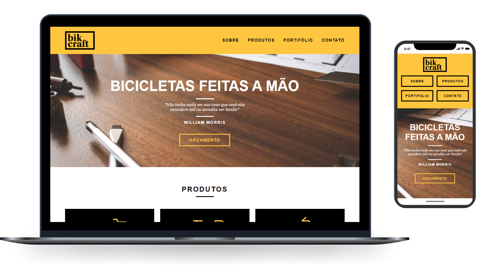

<h1 align="center">
    
</h1>

<p align="center">
  <a href="#-tecnologias">Tecnologias</a>&nbsp;&nbsp;&nbsp;|&nbsp;&nbsp;&nbsp;
  <a href="#-projeto">Projeto</a>&nbsp;&nbsp;&nbsp;|&nbsp;&nbsp;&nbsp;
  <a href="#-funcionamento">Obtendo e executando o projeto</a>&nbsp;&nbsp;&nbsp;|&nbsp;&nbsp;&nbsp;
  <a href="#-link">Link</a>&nbsp;&nbsp;&nbsp;|&nbsp;&nbsp;&nbsp;

</p>

<p align="center">
  
  
  
</p>

<br>

<p align="center">
  
</p>

## 🚀 Tecnologias

Esse projeto foi desenvolvido com as seguintes tecnologias:

- [HTML](https://www.w3schools.com/html/)
- [CSS](https://www.w3schools.com/css/)
- [JavaScript](https://www.javascript.com/)

## 💻 Projeto

Bikcraft é um site que oferece serviços para montagem de bicicletas feitas a mão, com valores como: Qualidade em todo o processo de construção, Foco no cliente, Preservação da natureza e Sustentabilidade.

## 🌐 Funcionamento

```bash
# 1º Clone o repositório
git clone https://github.com/aldotheapache1/Bikcraft.git
```

Após isso, é nescessária a utilização de uma ferramenta como o [Live Server](https://marketplace.visualstudio.com/items?itemName=ritwickdey.LiveServer) para executar um servidor local do projeto.

## 🔖 Link

Neste link abaixo você encontra o projeto web, hospedado em uma plataforma gratuita. O projeto funciona de forma responsiva, em computadores, tablets e celulares.

- [Link do projeto](https://gianlucas.000webhostapp.com/)
